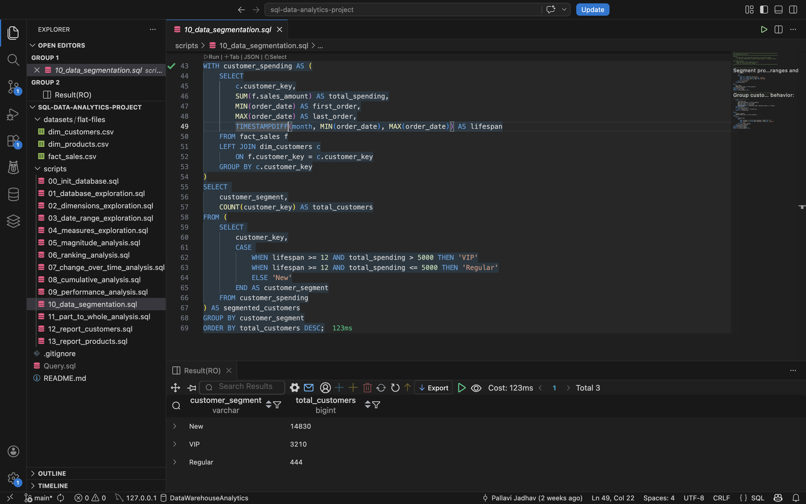
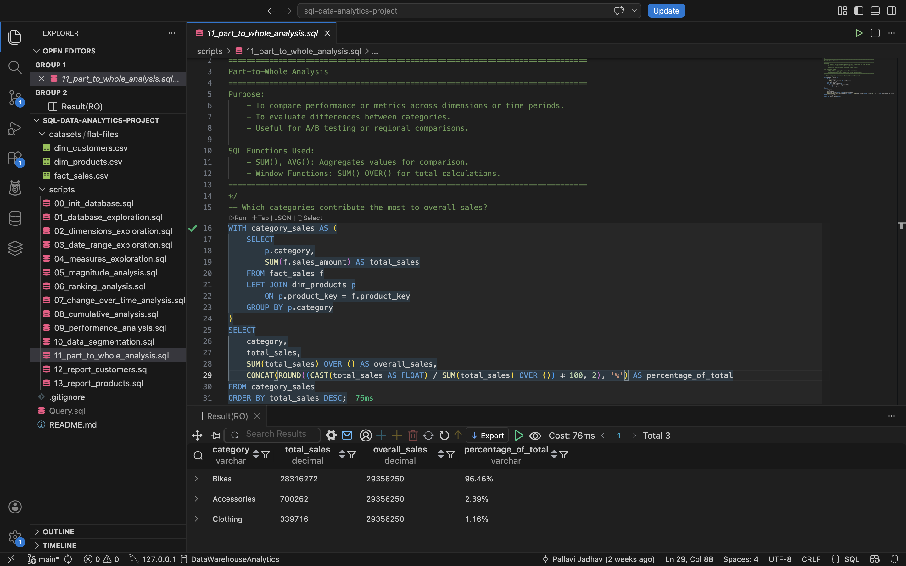

# Sales Performance & Customer Insights Using Advanced SQL 

An end-to-end SQL analytics project focused on exploring sales data and uncovering meaningful business insights. The project demonstrates a range of analytical techniques, from data exploration and KPI development to customer segmentation, performance benchmarking, trend analysis, and reporting.

---

## Project Overview

This project analyzes sales data across customers, products, and transactions using advanced SQL. Through a series of analytical queries, it examines sales performance, customer behavior, product trends, and category contributions to support business reporting and strategic decision-making.

**Business Questions Answered:**
- Which products and customers drive the most revenue?
- How has sales performance changed over time?
- Which customer segments (VIP, Regular, New) are most valuable?
- What is each product category's share of total sales?
- How do products perform year-over-year compared to their historical average?

---

## Database Schema

Three core tables form the foundation:

| Table | Type | Description |
|---|---|---|
| `dim_customers` | Dimension | Customer demographics: name, country, gender, birthdate |
| `dim_products` | Dimension | Product catalogue: category, subcategory, cost, product line |
| `fact_sales` | Fact | Transactional sales data: orders, amounts, quantities, dates |

---

## Project Structure

```
sql-data-analytics-project/
│
├── datasets/
│   └── flat-files/
│       ├── dim_customers.csv
│       ├── dim_products.csv
│       └── fact_sales.csv
│
├── 00_init_database.sql          # Database & table creation, CSV data loading
├── 01_database_exploration.sql   # Schema inspection via INFORMATION_SCHEMA
├── 02_dimensions_exploration.sql # Unique values across dimension tables
├── 03_date_range_exploration.sql # Temporal boundaries of the dataset
├── 04_measures_exploration.sql   # Core KPIs: revenue, orders, customers
├── 05_magnitude_analysis.sql     # Aggregations by country, gender, category
├── 06_ranking_analysis.sql       # Top/bottom products and customers
├── 07_change_over_time_analysis.sql  # Monthly/yearly sales trends
├── 08_cumulative_analysis.sql    # Running totals and moving averages
├── 09_performance_analysis.sql   # Year-over-Year product benchmarking
├── 10_data_segmentation.sql      # Customer & product segmentation
├── 11_part_to_whole_analysis.sql # Category contribution to total sales
├── 12_report_customers.sql       # Final customer report view
└── 13_report_products.sql        # Final product report view
```

---

## SQL Techniques Used

| Technique | Files |
|---|---|
| `GROUP BY`, `ORDER BY`, aggregate functions | 04–06 |
| `DISTINCT`, schema queries | 01–02 |
| `MIN()`, `MAX()`, `DATEDIFF()` | 03 |
| `JOIN` (LEFT JOIN across fact & dimensions) | 05–06, 09–13 |
| Window functions: `RANK()`, `DENSE_RANK()`, `ROW_NUMBER()` | 06 |
| Window functions: `SUM() OVER()`, `AVG() OVER()`, `LAG()` | 08–09 |
| CTEs (`WITH` clause) | 09–13 |
| `CASE` statements for conditional segmentation | 10, 12, 13 |
| `UNION ALL` for KPI summary reports | 04 |
| `CREATE VIEW` for reusable report layers | 12–13 |
| Date functions: `YEAR()`, `MONTH()`, `DATETRUNC()`, `FORMAT()` | 07 |

---

## Key Analyses

### Customer Segmentation (`10_data_segmentation.sql`)
Customers are segmented into three tiers based on spending behaviour and tenure:
- **VIP** — 12+ months lifespan and total spend > €5,000
- **Regular** — 12+ months lifespan and total spend ≤ €5,000
- **New** — lifespan under 12 months

### Year-over-Year Performance (`09_performance_analysis.sql`)
Uses `LAG()` and `AVG() OVER()` window functions to compare each product's annual sales against:
- Its own historical average (above/below avg)
- The prior year's sales (increase/decrease/no change)

### Cumulative Analysis (`08_cumulative_analysis.sql`)
Computes running total revenue and a moving average price across years using `SUM() OVER()` and `AVG() OVER()`, enabling long-term trend visibility.

### Part-to-Whole Analysis (`11_part_to_whole_analysis.sql`)
Calculates each product category's percentage contribution to total revenue using `SUM() OVER()` as a window-level total denominator.

### Executive Reports (`12_report_customers.sql`, `13_report_products.sql`)
Two reusable SQL views consolidate all key metrics into a single output per entity:

**Customer Report KPIs:**
- Age group, customer segment, recency (months since last order)
- Total orders, sales, quantity, products purchased
- Average order value (AOV), average monthly spend

**Product Report KPIs:**
- Product segment (High-Performer / Mid-Range / Low-Performer)
- Recency, lifespan, total orders, total customers
- Average selling price, average order revenue (AOR), average monthly revenue

---
## Key Findings

- **Bikes dominate revenue** — contributing 96.46% of total sales, 
  with Accessories (2.39%) and Clothing (1.16%) as minor categories
- **VIP customers are a small but critical segment** — 3,210 VIPs 
  vs 14,830 New customers, suggesting strong acquisition but 
  retention opportunity
- **New customers vastly outnumber loyal ones** — conversion from 
  New → Regular (444) is a key business gap

## Output Screenshots



## How to Run

1. **Set up the database** — Run `00_init_database.sql` in MySQL Workbench. Update the CSV file paths in the `LOAD DATA LOCAL INFILE` statements to match your local directory.

2. **Enable local file loading** — The script sets `local_infile = 1` automatically. Make sure your MySQL connection also has this enabled.

3. **Run scripts in order** — Each file builds on the previous. Run `01` through `13` sequentially for the full analytical walkthrough.

4. **View final reports** — After running `12` and `13`, query the views directly:
   ```sql
   SELECT * FROM report_customers;
   SELECT * FROM report_products;
   ```

---

## Tools & Environment

- **Database:** MySQL 8.x
- **IDE:** VS Code with SQL extensions / MySQL Workbench
- **Data format:** CSV flat files loaded via `LOAD DATA LOCAL INFILE`

---

## About

Built as part of an advanced SQL analytics portfolio project, this work demonstrates skills relevant to Data Analyst and Business Intelligence roles, including advanced SQL querying, KPI development, customer segmentation, performance benchmarking, and time-series analysis. This end-to-end approach showcases how analytical reporting and KPI-driven insights can help decision-makers monitor performance, identify opportunities, and support data-driven growth strategies across an organization.
